# ColorWalk - 基于Web3D的多人在线色彩学习平台

## 项目组织结构

### 前端

#### 1.页面截图

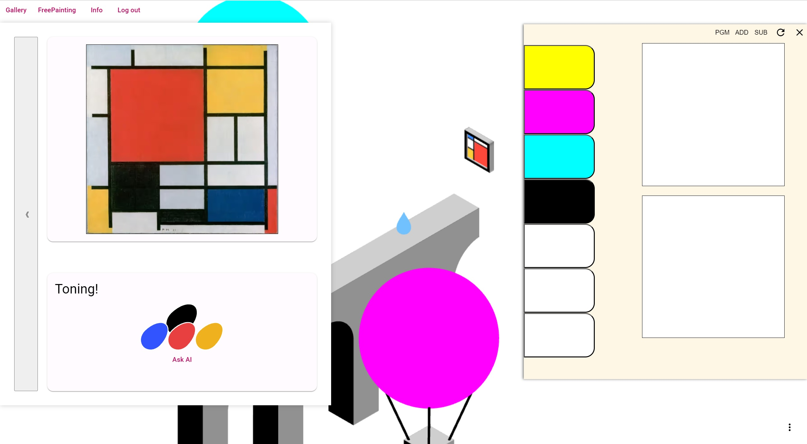

#### 2.代码组织结构

```
│  index.html
│  main.ts
│  styles.css
│
├─app
│  │  app.component.css
│  │  app.component.html
│  │  app.component.spec.ts
│  │  app.component.ts
│  │  app.config.ts
│  │  app.routes.ts
│  │  auth.guard.ts
│  │  auth.service.ts
│  │  color.service.spec.ts
│  │  color.service.ts
│  │  painting-near.service.spec.ts
│  │  painting-near.service.ts
│  │  palette-close.service.spec.ts
│  │  palette-close.service.ts
│  │  palette-color.service.spec.ts
│  │  palette-color.service.ts
│  │  zone-pass.service.spec.ts
│  │  zone-pass.service.ts
│  │
│  ├─ai-chat
│  │      ai-chat.component.css
│  │      ai-chat.component.html
│  │      ai-chat.component.spec.ts
│  │      ai-chat.component.ts
│  │
│  ├─eyedropper
│  │      eyedropper.component.css
│  │      eyedropper.component.html
│  │      eyedropper.component.spec.ts
│  │      eyedropper.component.ts
│  │
│  ├─floating-action-button
│  │      floating-action-button.component.css
│  │      floating-action-button.component.html
│  │      floating-action-button.component.spec.ts
│  │      floating-action-button.component.ts
│  │
│  ├─login
│  │      login.component.css
│  │      login.component.html
│  │      login.component.spec.ts
│  │      login.component.ts
│  │
│  ├─palette
│  │      palette.component.css
│  │      palette.component.html
│  │      palette.component.spec.ts
│  │      palette.component.ts
│  │
│  ├─ui-painting
│  │      ui-painting.component.css
│  │      ui-painting.component.html
│  │      ui-painting.component.spec.ts
│  │      ui-painting.component.ts
│  │
│  ├─user-manage
│  │      user-manage.component.css
│  │      user-manage.component.html
│  │      user-manage.component.spec.ts
│  │      user-manage.component.ts
│  │
│  ├─white-world
│  │      player.ts
│  │      white-world.component.css
│  │      white-world.component.html
│  │      white-world.component.spec.ts
│  │      white-world.component.ts
│  │      white-world.service.ts
│  │
│  └─world
│          player.ts
│          world.component.css
│          world.component.html
│          world.component.spec.ts
│          world.component.ts
│          world.service.ts
│          zone.ts
│
└─assets
    ├─models
    │      //省略
    │
    └─pictures
           //省略
```

文件说明：

- `app.component`：处理页面应用的功能导航。

- `app.routes`：定义应用的路由配置，指定了各个路径对应的组件，并使用了路由守卫来保护除登录外的页面。

- `auth.service`：提供用户登录状态的管理方法和接口定义，包括设置、获取用户名，检查用户是否已登录，用户登录和注销的处理以及用户认证请求、用户信息管理、本地状态存储。

- `color.service`：定义了取色器选择一个新颜色后的颜色通知和颜色更新接口。

- `painting-near.service`：提供用于在用户靠近绘画区域时发出事件通知的接口。

- `palette-close.service`：提供用于通知调色板的关闭状态变化的接口。

- `palette-color.service`：提供用于通知和获取调色板上当前的颜色的接口。

- `zone-pass.service`：提供管理和通知用户通过的区域编号变化的接口。

- `ai-chat`：用户与AI助手聊天页面，提供用户与 AI 聊天的功能，支持消息发送和接收以及交互过程中的加载指示。

- `eyedropper`：调色板中的取色，利用 EyeDropper API 从屏幕上选择颜色，并将选取的颜色更新到 `PaletteColorService` 服务中。

- `floating-action-button`：呼出调色板相关功能的浮动操作按钮，用户可以通过该按钮显示调色板、启动取色器并进行其他操作，同时支持通过键盘快捷键触发这些功能。

- `login`：登录界面，提供用户登录和注册功能，支持显示登录和注册的成功或失败消息。

- `palette`：调色板界面，允许用户在界面上选择和混合颜色，并提供了相关的颜色选取、上色和涂抹混合的功能。

- `ui-painting`：色彩比对功能界面，用于管理调色板颜色的选择和比较，处理颜色通过的逻辑，更新显示的图片，并在用户靠近画作时触发相关事件，与多个服务（ `PaletteColorService`、`ZonePassService`、`PaintingNearService` 和 `AuthService`）进行交互，以同步当前颜色、处理区域通过、响应靠近画作的信号和更新用户的通关状态。

- `user-manage`：用户信息管理，用于用户和管理员管理用户信息、显示用户列表，并提供注销删除用户功能。

- `white-world`：支持多人同时在线的自由上色界面，渲染一个3D场景并响应用户的颜色选择与绘制操作，同时与 `WhiteWorld` 和 `ColorService` 服务进行交互，以初始化3D场景、处理动画、并根据用户选取的颜色实时更新场景中的颜色。

- `world`：玩家从场景取色、调色、通过关卡的界面，由`player` `world.service` `zone`组成。`world`服务承担了 Three.js 虚拟场景的创建、更新和管理,作为应用程序的核心部分,协调各个子系统的工作，与其他服务(如`ZonePassService`、`PaintingNearService`、`AuthService`)协同工作,根据用户的学习状态动态加载关卡内容并响应用户与场景的交互。`zone`负责加载和管理不同区域或关卡的 3D 模型和动画，基类 `Zone` 提供了加载走廊模型、空气墙(障碍物)、画作和处理区域过渡逻辑的通用方法。子类并添加了装载具有动画效果的装饰性3D模型以及渐变动画等功能。


#### 3.系统架构

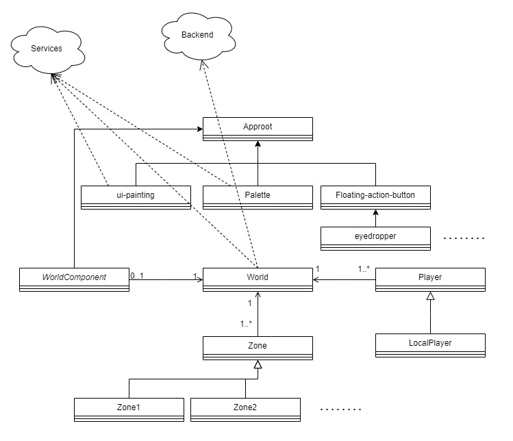

#### 4.设计模式

##### 4.1 观察者模式

由于架构中信息的流向比较复杂，例如吸色、调色等都需要更新颜色信息等等，组件间并非简单的父子关系，故对于一些常用的信号，采用订阅-发布模式即观察者模式。

Services包括用户服务、颜色服务、玩家位置相关服务、通关信息传递服务和调色板服务。

##### 4.2 策略模式

在调色中，我们提供了三种调色方法：加色模式（光学）、减色模式（CMY空间）、我们原创的模拟颜料插值调色。为了方便地兼容各种策略，我们使用了策略模式，用户可通过按钮切换当前的混色策略。


#### 5. 关键功能实现细节

##### 5.1 调色功能

###### 5.1.1 颜色混合调制

 [**完整代码实现**](./frontend/ColorWalk/src/app/palette/palette.component.ts)

当用户点击调色板上的颜色按钮时,该方法会将按钮颜色与当前画布颜色进行混合,根据所选混色方式生成一种新的颜色,并更新 `currentColor` 属性。

由于减色法、加色法都与现实世界颜料色彩调制在某些情况有较大出入，因此为用户提供了除两种混色法外的一种原创的插值混色法：

```typescript
mixColor(color: string) {
    const currentRgb = this.hexToRgb(this.currentColor);
    const newRgb = this.hexToRgb(color);
    if (currentRgb.r === 255 && currentRgb.g === 255 && currentRgb.b === 255) {
      this.currentColor = color;
      this.currentColorDiv['background-color'] = color;
      console.log(this.currentColorDiv['background-color']);
      return;
    }
    const rate = 0.05;
    const meanr = currentRgb.r + (newRgb.r -  currentRgb.r) * rate;
    const meang = currentRgb.g + (newRgb.g -  currentRgb.g) * rate;
    const meanb = currentRgb.b + (newRgb.b -  currentRgb.b) * rate;

    const minr = Math.min(meanr, currentRgb.r);
    const ming = Math.min(meang, currentRgb.g);
    const minb = Math.min(meanb, currentRgb.b);

    const r = Math.round(0.5 * meanr + 0.5 * minr).toString(16).padStart(2, '0');;
    const g = Math.round(0.5 * meang + 0.5 * ming).toString(16).padStart(2, '0');;
    const b = Math.round(0.5 * meanb + 0.5 * minb).toString(16).padStart(2, '0');;

    this.currentColor = '#' + r + g + b;
    this.currentColorDiv['background-color'] = this.currentColor;
  }
```

具体来说,使用了一种 "插值" 的混合方式:首先计算新旧两种颜色的 RGB 值,然后根据一个固定的混合率 `rate` (这里是 0.05),计算新颜色的 RGB 值为旧颜色 RGB 值与(新颜色 RGB 值 - 旧颜色 RGB 值)的线性插值。但有一点改进,插值结果不是直接作为新颜色的 RGB 值,而是与旧颜色 RGB 值的最小值进行等权重平均,以避免颜色过于饱和。


###### 5.1.2 色彩比对判定

[**完整代码实现**](./frontend/ColorWalk/src/app/ui-painting/ui-painting.component.ts)

初始化时,根据当前通过的关卡数 `currentZonePassNumber` 加载对应的目标颜色组 `colorDrops`。每个 `colorDrop` 对象包含了一个颜色值、是否被选中、是否通过比较的状态，用户可以通过点击颜色方块来选择当前要比对的颜色 `drop.color`。

在 `compareColor` 方法中,会将用户从调色板选择的当前颜色 `currentColor` 与被选中的目标颜色 `drop.color` 进行比较。

比较方式是**将两种颜色转换为 RGB 值,计算它们 RGB 值的绝对差之和。如果差值小于给定阈值(这里是80),则判定为通过比较,将 `drop.passed` 设为 true**。

如果所有目标颜色都通过了比较(`checkPass` 返回 true),就代表通过了当前关卡。这时会更新用户数据的通过关卡数并加载下一关卡的目标颜色组。

如果是 bonus 关卡,则会生成一个随机颜色作为目标颜色。

在判定过程中,如果用户靠近了画作位置,就会显示当前的画作和颜色选择界面。


###### 5.1.3 页面取色

[**完整代码实现**](./frontend/ColorWalk/src/app/eyedropper/eyedropper.component.ts)

通过调用浏览器提供的 EyeDropper API,允许用户从屏幕上任意位置取色,并将取色结果广播给其他组件使用。具体过程如下:

1. **判断浏览器是否支持 EyeDropper API**

在组件的构造函数中,通过检查 `window` 对象中是否存在 `EyeDropper` 属性来判断浏览器是否支持该 API。目前只有 Chrome 和 Edge 浏览器支持这个 API。

2. **打开取色器**

在 `nativePick` 方法中,首先创建一个 `EyeDropper` 实例,然后调用实例的 `open()` 方法。这将打开一个系统级别的取色器界面,允许用户从屏幕上任意位置选取一种颜色。

3. **获取选取的颜色**

用户选取颜色后,`open()` 方法会返回一个 Promise,其 `resolve` 的值包含了所选颜色的信息。代码中获取了颜色的十六进制表示 `sRGBHex`,并将其转换为十进制整数值。

4. **处理用户取消**

如果用户在取色器中按下 Esc 键或手动取消操作,`open()` 方法的 Promise 会被 `reject`,代码中捕获了这种情况并输出一条日志。

5. **更新颜色**

获取到颜色值后,代码会通过 `PaletteColorService` 服务将其广播出去,以便其他组件(如调色板组件)可以获取到这个新的颜色值并做出响应。

###### 5.1.4 实时试色画板

[**完整代码实现**](./frontend/ColorWalk/src/app/palette/palette.component.ts)

当用户在画布上点击或拖动鼠标时,该方法会将指定颜色 `newColor` 混合到画布上相应位置的像素中。具体来说,它会获取以鼠标位置为中心的一个圆形区域内的像素数据,然后对于圆形区域内的每个像素,如果该像素原来是白色,则直接用新颜色替换;否则,将该像素的颜色与新颜色进行平均。这样做的效果是在画布上形成了一个圆形的颜色斑点,边缘地方是新旧颜色的过渡。


##### 5.2 基于Three.js的3D场景交互

###### 5.2.1 响应式相机

[**完整代码实现**](./frontend/ColorWalk/src/app/world/world.service.ts)

```typescript
  public resize(): void {
    console.log("resized");
    const width = window.innerWidth;
    const height = window.innerHeight;
  
    const aspect = width / height;
    const frustumSize = 10;
  
    this.camera.left = frustumSize * aspect / -this.scene_scale;
    this.camera.right = frustumSize * aspect / this.scene_scale;
    this.camera.top = frustumSize / this.scene_scale;
    this.camera.bottom = frustumSize / -this.scene_scale;
    this.camera.updateProjectionMatrix();
  
    this.renderer.setSize(width, height);
  }
```

`resize`方法可以响应窗口大小变化的。具体原理如下:

1. 在组件初始化时,通过 `window.addEventListener('resize', ...)` 为窗口大小变化事件绑定了一个回调函数。

2. 当窗口大小发生变化时,回调函数 `resize` 会被触发执行。

3. 在 `resize` 方法中,首先获取新的窗口宽度和高度 `window.innerWidth` 和 `window.innerHeight`。

4. 然后根据窗口的宽高比 `aspect` 和预设的视锥体尺寸 `frustumSize`,计算新的视锥体左右上下平面在归一化设备坐标系(NDC)中的位置(`camera.left`、`camera.right`、`camera.top`、`camera.bottom`)。

5. 调用 `camera.updateProjectionMatrix()` 使用新计算出的视锥体平面更新相机的投影矩阵。

6. 最后调用 `renderer.setSize(width, height)` 将渲染器的输出尺寸设置为新的窗口大小。

###### 5.2.2 场景动态加载

[**完整代码实现**](./frontend/ColorWalk/src/app/world/world.service.ts)

场景模型的动态加载是通过延迟加载的方式实现的,具体原理如下:

1. **初始化阶段**

在初始化阶段,只会加载第一个区域(Zone1)的模型。通过调用 `initZone1` 方法,实例化一个 `Zone1` 对象,并将其添加到 `zones` 数组中。

2. **订阅学习记录更新**

代码通过订阅 `zonePassService` 的 `zoneNumber` observable 以及调用 `getMyZonePassedNumber` 方法来获取当前用户的学习记录(通过关卡的数量)。一旦获取到最新的学习记录,就会将 `isLatestRecord` 标记设置为 true,表示可以根据记录动态加载场景了。

3. **渲染循环中动态加载**

在渲染循环 `render` 方法中,会检查 `isLatestRecord` 和 `currentZonePassNumber` 与 `preZonePassNumber` 之间的差值。如果差值大于 0,表示用户已经通过了一些新的关卡,需要加载对应的新区域模型。

代码会遍历这个差值,并根据 `preZonePassNumber` 的值,分别调用 `initZone2`、`initZone3` 和 `initZone4` 方法,实例化并添加新的区域对象到 `zones` 数组中。同时,`preZonePassNumber` 会递增,直到与 `currentZonePassNumber` 相等为止。

4. **区域模型的更新**

一旦新的区域模型被加载,在每一帧的渲染循环中,`zones` 数组中的所有区域对象都会被遍历,并调用它们的 `update` 方法。这样一来,新加载的区域模型就会参与到场景的渲染和更新中了。

由于模型的加载是基于用户的实际学习进度的,能保证用户在任何时候看到的场景都是与自己的进度相符的。

###### 5.2.3 模型实时上色

[**完整代码实现**](./frontend/ColorWalk/src/app/white-world/white-world.service.ts)

场景表面颜色的动态改变是通过光线投射(Raycasting)实现的。具体原理如下:

1. **初始化阶段**

在加载3D模型时,会遍历模型中的所有网格(Mesh),为每个网格的顶点设置一个`color`属性为初始颜色。同时,会为每个网格设置一种支持顶点颜色的基本材质(`MeshBasicMaterial`)。

2. **鼠标点击事件**

当用户在canvas上点击时,会触发`coloration`方法。此方法中首先通过`raycaster.setFromCamera`计算一条从相机发出、经过鼠标点击位置的射线。

3. **光线投射计算**

接下来,通过`raycaster.intersectObjects`方法,计算这条射线与场景中所有网格模型的交点。如果存在交点,则取第一个交点对应的三角形面片编号(`faceIndex`)和所属网格(`mesh`)。

4. **确定受影响顶点**

由于一个三角形面片由三个顶点构成,因此需要确定这三个顶点在网格的顶点索引数组中的索引。代码中使用了一种启发式算法:从当前面片开始,向上下两个方向遍历相邻的面片,判断它们与当前面片是否共享两个顶点。如果共享,则将第三个顶点也加入受影响顶点集合(`vSet`)。

5. **更新顶点颜色**

最后,代码遍历受影响顶点集合,将这些顶点的`color`属性设置为保存的新颜色(`savedColor`)。并且标记`colors.needsUpdate = true`,以确保颜色更新在下一帧被渲染。如果是在多人场景中,代码还会通过WebSocket将受影响的顶点索引和新颜色广播给其他客户端,以实现网络同步。


##### 5.3 场景实时交互

###### 5.3.1 人物位置与场景色彩同步

[**完整代码实现**](./frontend/ColorWalk/src/app/white-world/white-world.service.ts)

每个客户端都维护着一个本地的 3D 场景,其中包含了一个加载的 3D 模型。当用户在本地场景中点击模型的某个面片时,代码会执行 `coloration` 方法来改变该面片的颜色。具体过程如下:

1. 在 `coloration` 方法中,使用 Three.js 提供的 `Raycaster` 工具计算出用户点击的是哪个面片。
2. 根据点击的面片索引 `faceIndex`,遍历该面片相邻的所有面片,获取它们共享的顶点索引。
3. 使用新的颜色值更新这些顶点的颜色属性。
4. 生成一个 `updateMsg` 对象,包含了被更新的面片 ID、顶点索引列表和新的颜色值。
5. 调用 `player.updateColor(updateMsg)` 方法,将 `updateMsg` 发送到服务器。

接下来,服务器会收集所有客户端发来的颜色更新消息,并通过某种通信机制(如 WebSocket)将这些消息广播给所有连接的客户端。

当客户端收到广播的颜色更新消息时,就会执行 `socketColor` 方法来更新本地场景中模型的颜色:

1. 遍历收到的每个颜色更新消息 `item`。
2. 从 `item.points` 中解析出被更新的面片 ID 和顶点索引列表。
3. 从 `item.color` 中获取新的颜色值。
4. 在本地场景中查找具有相同 ID 的网格模型 `mesh`。
5. 遍历顶点索引列表,使用新的颜色值更新对应顶点的颜色属性。

由此途径,每个客户端都能实时接收其他客户端的颜色编辑操作,并在本地场景中同步更新模型的颜色。

###### 5.3.2 实时对话互动

[**完整代码实现**](./frontend/ColorWalk/src/app/white-world/white-world.service.ts)

代码中有一个数组 `onLineUser`用于存储当前在线的所有用户ID。当有新用户加入或离开时,该列表会实时更新。

 `messageQueue` 数组用于缓存待发送的消息。每个消息对象包含了消息内容、消息类型(公开/私聊)和接收者信息。

当用户通过 `sendMessage` 方法发送一条消息时,该方法会先判断接收者是否在线:

- 如果接收者是 `/all`(即公开消息),则直接将消息对象推入 `messageQueue`。
- 如果接收者是特定用户ID,则先检查该用户是否在 `onLineUser` 列表中,如果不在线则发送失败并给出提示;如果在线,则将消息对象推入 `messageQueue`。
- 最后,调用 `player.sendChatMessage` 方法,将消息发送到服务器。

#### 6.4 docker

提供了dockerfile，可在前端目录下查看，经测试build无问题。


### 后端

#### 1.系统架构

后端主要基于Spring Boot框架，使用mybatis做数据持久化，使用mysql作为数据库，jdbc进行数据库连接。
后端提供了WebSocket服务和用户信息相关操作的API，接口为3000。系统架构主要包括以下几个组件：

1. **WebSocket服务器**：处理客户端的WebSocket连接，接收和发送消息。
2. **用户信息相关 API**：提供用户管理的接口。
3. **数据存储**：使用mybatis进行持久化存储，数据库采用mysql


#### 2.代码架构
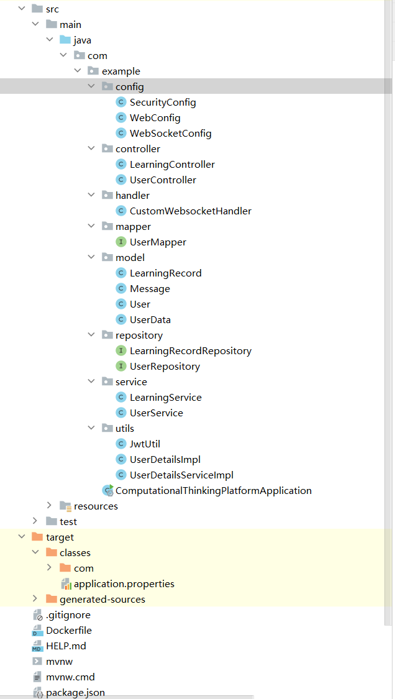

#### 详细设计

##### 2.1. WebSocket处理器


##### 2.2. User信息相关
**首先，定义数据结构User**：
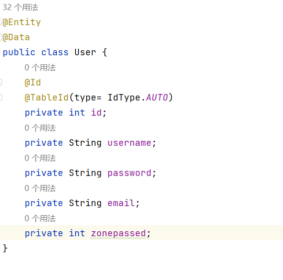
其中zonepassed为通关数。

**然后，使用mapper进行与数据库的映射**
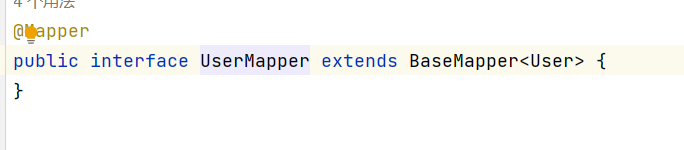

**接着定义Userservice类型**
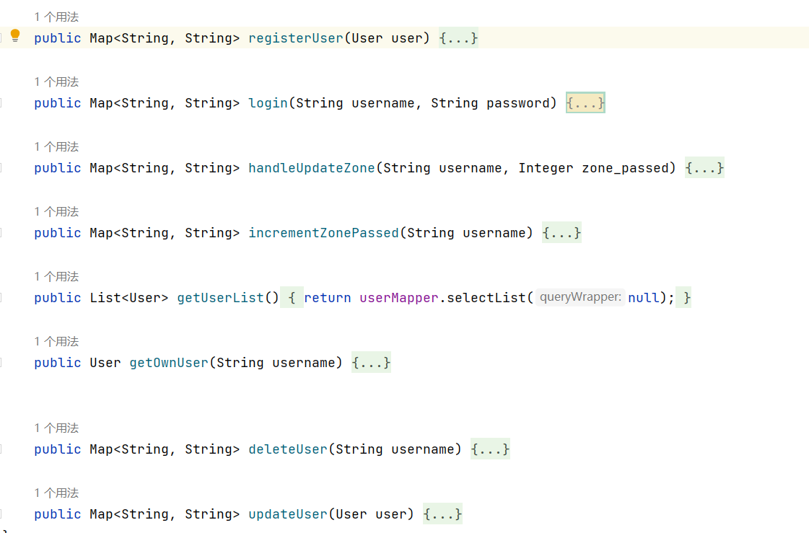
其中共包含8个服务，分别为用户登录、用户注册、更新过关数（自定义数量）、自增过关数、获取用户列表、获取单个用户信息、删除用户和更新用户。

这里面需要注意的是
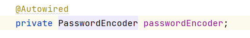
我们使用passwordencoder对密码进行加密处理，因为在用户信息传输的过程中，密码如果用明文传输会有泄漏风险。

**最后开放api接口供前端访问**
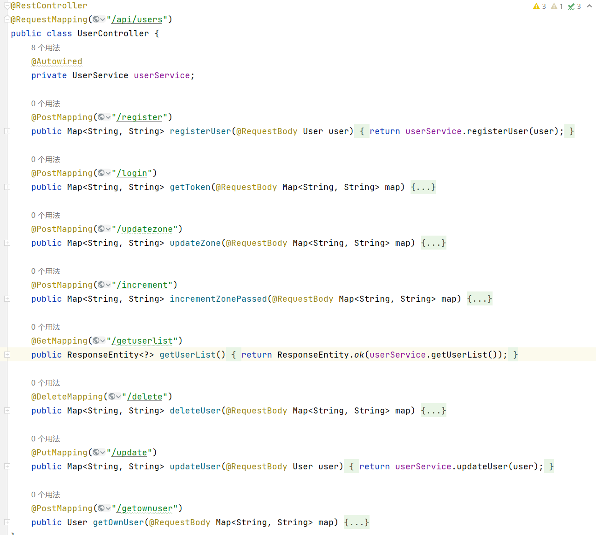

**数据库**
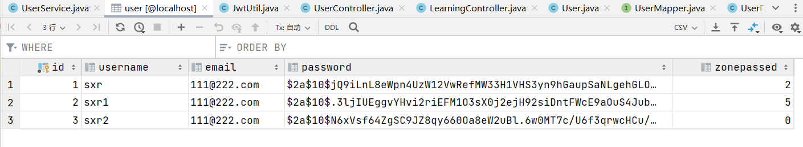
可以看出密码是加密过进行存储的


##### docker部署相关
准备pj.sql作为建表语句
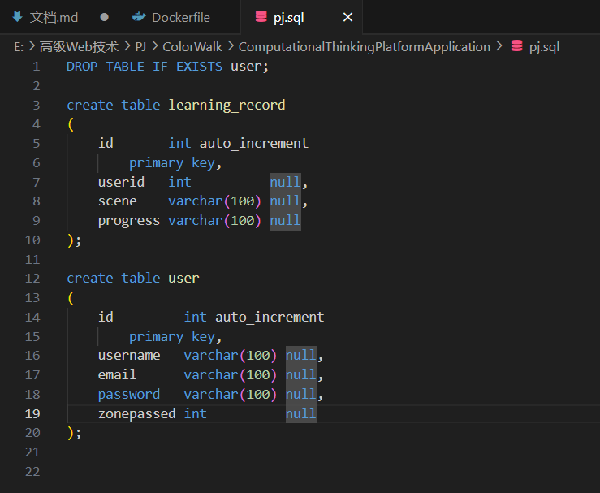

准备dockerfile准备构建镜像
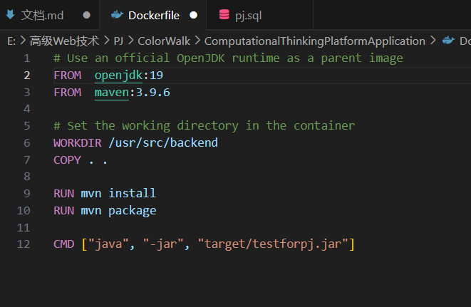


#### 2.3 socket

[**完整代码实现**](./ComputationalThinkingPlatformApplication/src/main/java/com/example/handler/CustomWebsocketHandler.java)

##### 2.3.1 功能

1. **连接管理**：
   
   - 在WebSocket连接建立时，发送初始化消息，包括设置会话ID、发送颜色数据和远程数据，前端可以用这些数据同步当前的场景上色情况和远端用户情况。
   
   - 在WebSocket连接关闭时，移除用户会话，并通知其他用户，前端可以基于这条消息将用户化身从场景中移出，同时将用户移出活跃用户范围，防止聊天时发生错误。
   
   - 数据全部以uid作为索引，用户连接时会传入一个uid，将其与连接创建的sid进行对应并记录，在后续的操作中即可使用uid进行查找。

2. **消息处理**：
   
   - 接受到消息时，可以根据消息的`type`进行分类，处理不同类型的消息，包括初始化消息、更新消息、颜色信息和聊天消息，根据消息类型会调用相应的处理方法。
   - 初始化消息为玩家连接同时发送的消息，包含位置，用户名等信息。运用用户名信息，可以将玩家的uid和sid建立映射关系，从而为后续的聊天做准备。
   - 更新消息用于更新玩家的位置，前端每次的移动都会同时发送这个消息同步移动给后端，后端则将新的位置同步给其他的远程前端。
   - 颜色信息用于更新玩家的上色，上色的内容通过一个`map`进行记录，通过物体名称，顶点编号和颜色来定位到对应的唯一面片。
   - 聊天消息用于实现聊天的功能，通过传入信息中的`chatType`进一步分为私聊和公屏，分别会对应到不同的分发模式。

3. **数据广播**：
   
   - 定期广播玩家数据，每40毫秒执行一次。
   - 广播颜色数据，当颜色信息更新时调用。
   - 广播在线用户信息，当新用户连接时调用。
   - 广播用户断开信息，当用户断开连接时调用。

##### 2.3.2 主要技术

1. **Spring WebSocket**：
   
   - 使用`TextWebSocketHandler`类来处理文本消息。
   - 覆写`afterConnectionEstablished`和`afterConnectionClosed`方法来管理WebSocket连接的建立和关闭。
   - 使用`handleTextMessage`方法来处理收到的文本消息。

2. **并发和定时任务**：
   
   - 使用`ConcurrentHashMap`来存储用户会话信息，确保在并发环境下线程安全。
   - 使用`ScheduledExecutorService`来定期执行广播任务，确保定时发送玩家数据。

3. **JSON处理**：
   
   - 使用Jackson库中的`ObjectMapper`来将Java对象与JSON字符串相互转换。
   - 在消息处理和广播中频繁使用JSON数据格式。

4. **会话管理**：
   
   - 使用`WebSocketSession`来表示每个WebSocket会话，存储在`userSessions`和`sid2uid`等映射中。
   - 通过会话ID和用户ID的映射关系来管理和识别用户。
